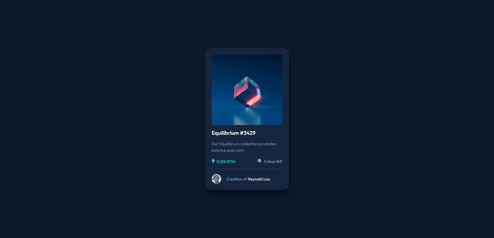
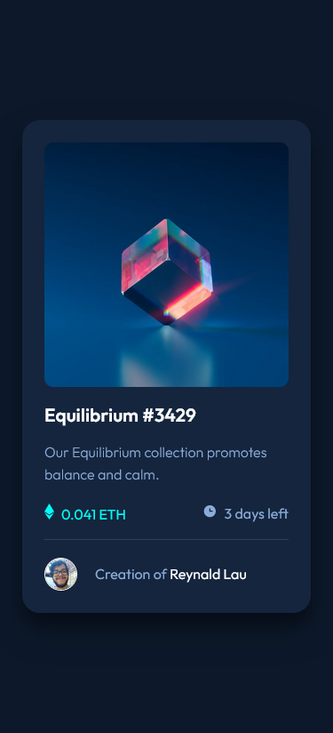

# Frontend Mentor - NFT preview card component solution


Essa é uma solução para o [desafio NFT preview card component do Frontend Mentor](https://www.frontendmentor.io/challenges/nft-preview-card-component-SbdUL_w0U).

## índice

- [Overview](#overview)
  - [Desafio](#Desafio)
  - [Screenshot](#screenshot)
  - [Links](#links)
- [Meu processo](#meu-processo)
  - [Desenvolvido com](#desenvolvido-com)
  - [O que eu aprendi](#o-que-eu-aprendi)
  - [Desenvolvimento contínuo](#desenvolvimento-contínuo)
- [Autor](#autor)

## Overview

### Desafio

Os usuários devem ser capazes de:

- Visualize o layout ideal dependendo do tamanho da tela do dispositivo
- Veja os estados de foco para elementos interativos

### Screenshot





### Links

- Link do desafio: [https://reynald-durans.github.io/ntf-preview-card-component/](https://reynald-durans.github.io/ntf-preview-card-component/)

## Meu processo

### Desenvolvido com

- Sass
- Mobile-first workflow
- Semantic HTML5 markup
- CSS custom properties
- Flexbox
- CSS Grid


### O que eu aprendi

Esse mini-projeto me ajudou a melhorar minha escrita de código mais limpo e melhorar a manutenibilidade usando o pré-processador Sass.

Para ver como você pode adicionar snippets de código, veja abaixo:

#### Usando box-sizing
Uma coisa que me ajudou muito no posicionamento das caixas sem transbordar o conteúdo interno foi usando a propriedade box-sizing, eu antes usava mais não sabia seu funcionamento, como por exemplo:
```css
.orgulho-desse-css {
  width: 150px;
  height: 150px;
  /* Com a caixa tendo seu valor predefinido o box-sizing com o valor border-box a caixa vai se comportar a partir daquele valor predefinido */
  box-sizing: border-box;
  /* inserindo espaçamento interno a caixa não irá transbordar */
  padding: 25px;
}
```

### Desenvolvimento contínuo

A partir desse projeto, pretendo continuar melhorando minhas habilidades com Sass e futuramente me adaptar com react.

## Autor

- Website - [Reynald](#)
- Frontend Mentor - [@reynald-durans](https://www.frontendmentor.io/profile/reynald-durans)
- Twitter - [@reynald_durans](https://twitter.com/reynald_durans)
